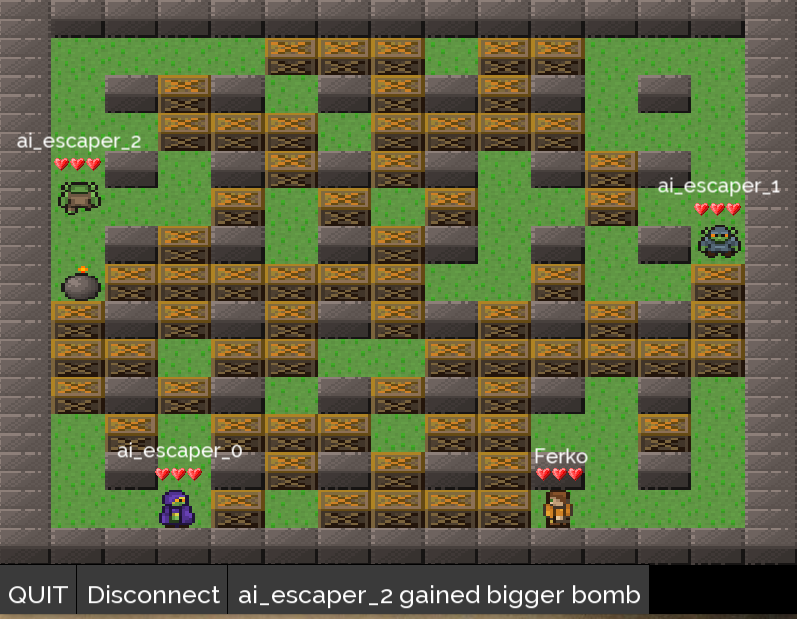

# Network Bomberman
- just an usual bomberman game playable both in single player and in multiplayer mode
- uses udp sockets for networking, with application specific heartbeat protocol

# Compilation guide

- [x] create .deb package for Linux [walktrough](https://www.internalpointers.com/post/build-binary-deb-package-practical-guide)
- [x] remove magic strings - when deploying, we need the media data to be in consistent location, which has to be set up
- [ ] investigate possibilities of deployment to Windows
- [ ] investigate possibilities of deployment to Android

# Acknowledgements
- [bomb party art](https://opengameart.org/content/bomb-party-the-complete-set)
- [small pixel hearts](https://opengameart.org/content/simple-small-pixel-hearts)
- [FFFTusj font](https://www.fontsquirrel.com/fonts/fff-tusj)
- [Raleway font](https://www.fontsquirrel.com/fonts/raleway)
- my girlfriend for all the power-ups drawings
- [Game development by example](https://www.packtpub.com/product/sfml-game-development-by-example/9781785287343)

